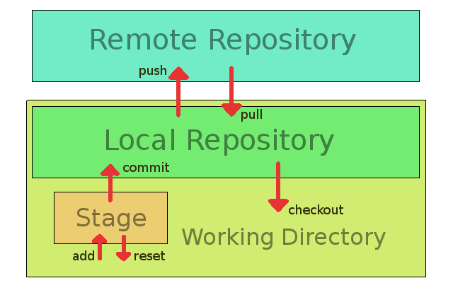
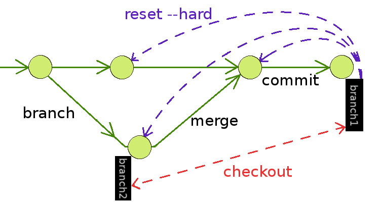

# What is this?

This is just for my personal practice. I left some notes so that I can review them in case I forget some commands to use git (and maybe some other stuff).
Most of the parts including the diagrams are now trifling to me, though... I don't know why I was so motivated to draw these diagrams.

# Diagrams
Some parts could be incomplete and even wrong. Don't trust me...

## Flow of updates between locations 


### upward
```
git add .
git commit -m <comment>
git push <alias> <branch>
```

### downward
```
git pull <alias> <branch>
git checkout <branch>
git reset
```


## Transitions between commits by git commands


commit
```
git commit -m <comment>
```

switch to another branch
```
git checkout <branch>
```

move to another commit
```
git reset --hard <commit id>
```

branch (and switch to the new branch)
```
git branch <new branch>
git checkout <new branch>
   or
git checkout -b <new branch>
```

merge
```
git merge <branch to merge>
```
merge (no fast forward: keeps the trajectory of the branch anyway)
```
git merge --no-ff <branch to merge>
```

# Memoranda

## Initial Settings
```
git config --global user.name "User Name"
git config --global user.email "foo@bar.com"
git config --global color.ui auto
git config --global alias.graph "log --graph --date-order --all --pretty=format:'%h %Cred%d %Cgreen%ad %Cblue%cn %Creset%s' --date=short"
```

## Merging with conflicts
```
git merge <branch to merge>
git diff
vi <file>
git add <file>
git commit -m <comment>
```
to abort merging
```
git reset
git checkout -- <file>
```

## Deletion of a branch
to delete a local branch
```
git branch -d <branch>
```
to delete a remote branch
```
git push <alias> :<branch>
```

## Temporary save of updates
to save the current staged updates
```
git stash
```
to restore the saved updates
```
git stash pop
```

## Cloning a repository
### from remote to local
to restore a repo from the remote one
```
git clone <URL>
```
to rename the alias
```
git remote rename origin <new alias>
```
to track a branch which does not exist in the local repo
```
git branch <branch> <alias>/<branch>
```

### from local to remote
to make a remote repo from the local
```
git clone --bare <directory> <URL>
```
to make an alias for the remote location
```
git remote add <alias> <URL>
```
to get branches on the remote
```
git fetch <alias>
```
to make the local branch to track the remote one
```
git branch --set-upstream-to=<alias>/<branch> <branch>
```


